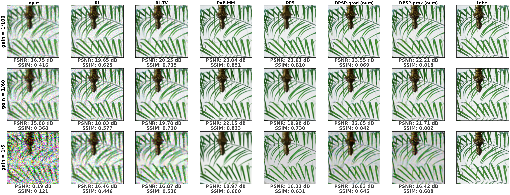
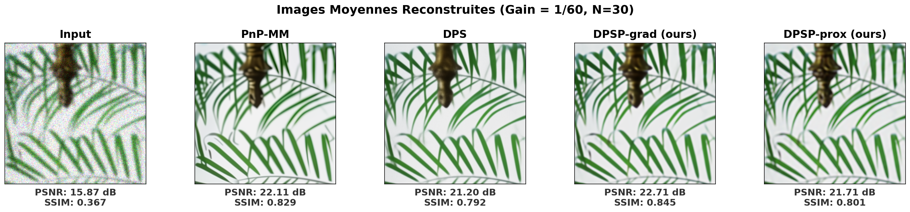
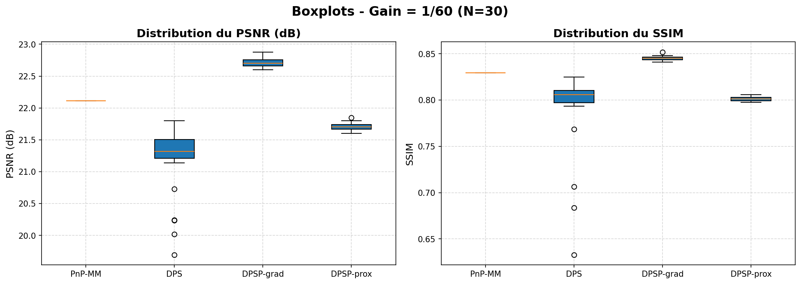
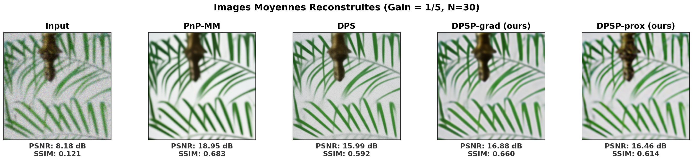
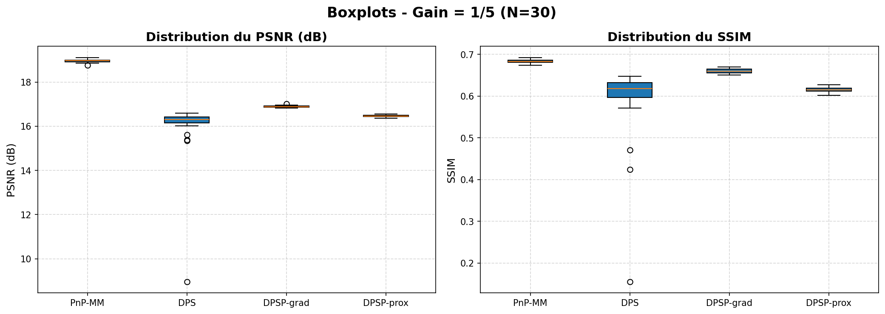

# Diffusion Posterior Sampling for Poisson Inverse Problems (DPSP)

Official repository for the internship project: **"Generative models for Poisson inverse problems: application to emission tomography"**.
This project extends **Diffusion Posterior Sampling (DPS)** [(Chung et al., 2023)](https://arxiv.org/abs/2209.14687) to Poisson-corrupted measurements in emission tomography (PET / SPECT) by introducing two dedicated algorithms: **DPSP-PROX** and **DPSP-GRAD**.

---

## Abstract

While deep neural networks outperform traditional reconstruction methods, recent generative models (e.g., diffusion models, flow matching) offer strong potential as priors for complex image distributions. However, their application to Poisson inverse problems remains under-explored due to the non-Lipschitz nature of the Poisson log-likelihood gradient near boundaries and the lack of a closed-form proximal operator for the Kullback-Leibler ($\text{KL}$) divergence.

In this work, we propose two novel algorithmic adaptations:
1. **DPSP-GRAD**: An Expectation-Maximization (EM)-inspired gradient step for DPS to stabilize updates and guarantee non-negativity ($x \ge 0$).
2. **DPSP-PROX**: A Majorization-Minimization (MM) approach providing a quadratic surrogate to bypass the absence of a closed-form proximal operator for the $\text{KL}$ divergence.

---
## Qualitative & Quantitative Results

---

### Comparaison of all methodes for differents noise levels.

  

### Moderate Noise Level (Gain = 1/60)

  

  

---

### High Noise Level (Gain = 1/5)

  

  

We only tested it on the deconvolution and only on natural images.

---

## Prerequisites

- **Python**: `3.10+` (Tested on `3.12`)
- **PyTorch**: `2.5.1+cu124`
- **CUDA**: `12.4`
- **Key dependencies**: `deepinv`, `optuna` (for hyperparameter tuning).

---
